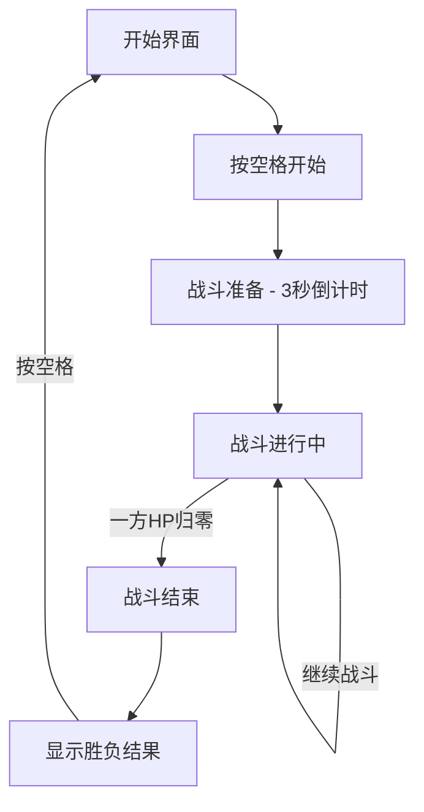

# 像素风机甲对战游戏 - 产品需求文档

## 1. 产品概述

一款复古像素风格的双人对战小游戏，两名玩家操控各自的风机甲进行战斗。

### 核心目标
- 为玩家提供紧张刺激的本地双人对战体验
- 复古像素美术风格唤起经典游戏情怀
- 简洁易上手的操作方式

### 目标用户
- 喜欢复古游戏的玩家
- 寻找休闲对战游戏的用户
- 寻求快速上手双人对战游戏的玩家

---

## 2. 核心功能

### 2.1 机甲角色系统

| 角色 | 外观特征 | 定位 |
|------|---------|------|
| 红色机甲 (RED) | 经典红色涂装，厚重装甲设计 | 攻击型：高伤害，低机动 |
| 蓝色机甲 (BLUE) | 科技蓝色涂装，流线型设计 | 平衡型：中伤害，中机动 |

### 2.2 战斗机制

**属性系统：**
- **生命值 (HP)**：100点，被攻击时减少
- **能量值 (Energy)**：50点，用于释放技能

**操作指令：**

| 操作 | 玩家1 (RED) | 玩家2 (BLUE) |
|------|-------------|-------------|
| 移动 | A (左) / D (右) | ← (左) / → (右) |
| 跳跃 | W | ↑ |
| 攻击 | J | 1 (小键盘) |
| 防御 | K | 2 (小键盘) |
| 技能 | L | 3 (小键盘) |

**攻击类型：**
1. **普通攻击**：近战拳击，伤害10点，无能量消耗
2. **防御**：减免50%受到的伤害，持续按住期间有效
3. **技能 - 能量冲击**：消耗20能量，远程攻击，伤害25点

### 2.3 游戏状态

- **开始界面**：显示游戏标题和"按空格开始"提示
- **战斗状态**：双方机甲进行对战
- **胜负判定**：当一方HP归零时，另一方获胜
- **结算界面**：显示胜者信息，提供重新开始选项

---

## 3. 用户交互流程



---

## 4. 用户界面设计

### 4.1 整体风格
- **美术风格**：8-bit像素艺术，致敬经典FC/SFC游戏
- **配色方案**：
  - 背景：深色工业风 (#1a1a2e)
  - 地面：金属质感 (#3d3d5c)
  - RED机甲：#ff4757
  - BLUE机甲： #3742fa
- **字体**：像素风格等宽字体
- **像素密度**：角色使用16x16像素网格，放大4倍显示

### 4.2 UI元素

**血条 (HP Bar)**：
- 位于屏幕顶部
- 红色机甲血条在左上，蓝色机甲血条在右上
- 血条颜色随HP减少由绿变红

**能量条 (Energy Bar)**：
- 位于血条下方
- 显示当前能量值

**胜负提示**：
- 居中大字显示
- 闪烁动画效果

### 4.3 场景布局
```
┌────────────────────────────────────────┐
│  [RED HP/EN]           [BLUE HP/EN]    │
│                                        │
│                                        │
│      ████                    ████      │
│      ████      VS            ████      │
│                                        │
│────────────────────────────────────────│
│            [战斗区域]                    │
└────────────────────────────────────────┘
```

---

## 5. 像素素材方案

### 5.1 机甲精灵设计

使用Canvas绘制的简化像素风格机甲：

**RED机甲 (红色系)**：
- 主体：深红色装甲
- 细节：黑色线条、银色关节
- 武器：拳头/手臂

**BLUE机甲 (蓝色系)**：
- 主体：深蓝色装甲
- 细节：黑色线条、黄色指示灯
- 武器：拳头/手臂

### 5.2 动画帧

| 动画类型 | 帧数 | 描述 |
|---------|------|------|
| 待机 | 2帧 | 微小上下浮动 |
| 行走 | 4帧 | 腿部交替移动 |
| 跳跃 | 2帧 | 起跳/下落姿态 |
| 攻击 | 3帧 | 拳击动作 |
| 防御 | 1帧 | 双手护体姿势 |
| 受击 | 2帧 | 闪烁效果 |
| 胜利 | 4帧 | 庆祝动作 |

### 5.3 特效

- **攻击特效**：简单的像素火花
- **技能特效**：能量波纹动画
- **受击特效**：角色闪烁

---

## 6. 技术规格

### 6.1 性能目标
- 帧率：60 FPS
- 响应延迟：<16ms

### 6.2 兼容性
- 目标浏览器：Chrome, Firefox, Safari, Edge
- 最低分辨率：800x600
