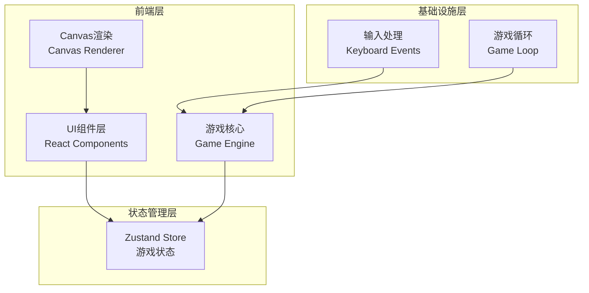

# 像素风机甲对战游戏 - 技术架构文档

## 1. 技术架构



## 2. 技术选型

| 技术 | 用途 | 版本 |
|------|------|------|
| React | UI框架 | 18.x |
| TypeScript | 类型安全 | 5.x |
| Vite | 构建工具 | 5.x |
| Zustand | 状态管理 | 4.x |
| TailwindCSS | 样式框架 | 3.x |

## 3. 核心模块设计

### 3.1 游戏状态管理 (Zustand Store)

```typescript
interface GameState {
  phase: 'start' | 'countdown' | 'playing' | 'end';
  winner: 'RED' | 'BLUE' | null;
  mechas: {
    RED: MechaState;
    BLUE: MechaState;
  };
}

interface MechaState {
  x: number;
  y: number;
  hp: number;
  energy: number;
  velocityX: number;
  velocityY: number;
  isJumping: boolean;
  isAttacking: boolean;
  isDefending: boolean;
  isUsingSkill: boolean;
  facing: 'left' | 'right';
  currentFrame: number;
  animation: 'idle' | 'walk' | 'jump' | 'attack' | 'defend' | 'hit';
}
```

### 3.2 游戏循环 (Game Loop)

- 使用 `requestAnimationFrame` 实现60FPS游戏循环
- 分离更新逻辑(Update)和渲染逻辑(Render)
- 固定时间步长保证物理一致性

### 3.3 输入处理

```typescript
interface InputState {
  player1: {
    left: boolean;
    right: boolean;
    jump: boolean;
    attack: boolean;
    defend: boolean;
    skill: boolean;
  };
  player2: {
    left: boolean;
    right: boolean;
    jump: boolean;
    attack: boolean;
    defend: boolean;
    skill: boolean;
  };
}
```

### 3.4 碰撞检测

- AABB (Axis-Aligned Bounding Box) 矩形碰撞
- 攻击判定框独立于角色身体
- 防御状态缩小受击判定区域

### 3.5 像素渲染器

- Canvas 2D Context 绘制
- 手动绘制像素风格角色（避免外部素材依赖）
- 放大像素块实现复古效果

## 4. 组件结构

```
src/
├── components/
│   ├── GameCanvas.tsx      # 游戏画布主组件
│   ├── Mecha.tsx           # 机甲渲染组件
│   ├── HealthBar.tsx       # 血条组件
│   ├── EnergyBar.tsx       # 能量条组件
│   ├── StartScreen.tsx     # 开始界面
│   ├── EndScreen.tsx       # 结算界面
│   ├── Countdown.tsx       # 倒计时组件
│   └── ControlHints.tsx   # 操作提示
├── stores/
│   └── gameStore.ts        # Zustand 游戏状态
├── hooks/
│   ├── useGameLoop.ts      # 游戏循环 Hook
│   ├── useInput.ts         # 输入处理 Hook
│   └── useMechaRenderer.ts # 机甲渲染 Hook
├── utils/
│   ├── collision.ts        # 碰撞检测
│   ├── constants.ts        # 游戏常量
│   └── mechaSprite.ts      # 机甲精灵绘制
├── types/
│   └── game.ts             # 类型定义
└── App.tsx                 # 应用入口
```

## 5. 关键算法

### 5.1 机甲移动

```typescript
const GRAVITY = 0.8;
const MOVE_SPEED = 5;
const JUMP_FORCE = -15;
const GROUND_Y = 400;

function updateMecha(mecha: MechaState, input: PlayerInput) {
  if (input.left) mecha.x -= MOVE_SPEED;
  if (input.right) mecha.x += MOVE_SPEED;
  if (input.jump && !mecha.isJumping) {
    mecha.velocityY = JUMP_FORCE;
    mecha.isJumping = true;
  }
  mecha.velocityY += GRAVITY;
  mecha.y += mecha.velocityY;
  if (mecha.y >= GROUND_Y) {
    mecha.y = GROUND_Y;
    mecha.isJumping = false;
    mecha.velocityY = 0;
  }
}
```

### 5.2 攻击判定

```typescript
function checkAttack(
  attacker: MechaState,
  defender: MechaState
): boolean {
  const attackRange = 60;
  const attackBox = {
    x: attacker.facing === 'right'
      ? attacker.x + 40
      : attacker.x - attackRange,
    y: attacker.y - 60,
    width: attackRange,
    height: 40
  };
  return boxCollision(attackBox, getDefenderBox(defender));
}
```

### 5.3 伤害计算

```typescript
function calculateDamage(
  baseDamage: number,
  defender: MechaState
): number {
  if (defender.isDefending) {
    return Math.floor(baseDamage * 0.5);
  }
  return baseDamage;
}
```

## 6. 动画系统

### 6.1 动画帧控制

```typescript
const ANIMATION_FRAMES = {
  idle: { frames: 2, duration: 500 },
  walk: { frames: 4, duration: 200 },
  jump: { frames: 2, duration: 100 },
  attack: { frames: 3, duration: 150 },
  defend: { frames: 1, duration: 0 },
  hit: { frames: 2, duration: 100 }
};
```

### 6.2 渲染循环

```typescript
function renderFrame(
  ctx: CanvasRenderingContext2D,
  mecha: MechaState,
  color: string
) {
  ctx.clearRect(0, 0, canvas.width, canvas.height);
  
  const sprite = getMechaSprite(mecha.animation, mecha.currentFrame);
  drawMecha(ctx, mecha.x, mecha.y, sprite, color, mecha.facing);
  
  if (mecha.animation === 'attack') {
    drawAttackEffect(ctx, mecha);
  }
  if (mecha.isDefending) {
    drawDefendShield(ctx, mecha);
  }
}
```

## 7. 胜负判定

```typescript
function checkWinCondition(state: GameState): 'RED' | 'BLUE' | null {
  if (state.mechas.RED.hp <= 0) return 'BLUE';
  if (state.mechas.BLUE.hp <= 0) return 'RED';
  return null;
}
```

## 8. 性能优化

- 使用 `will-change` 优化Canvas渲染
- 限制状态更新频率
- 使用 `useCallback` 缓存事件处理器
- 对象池复用特效实例
