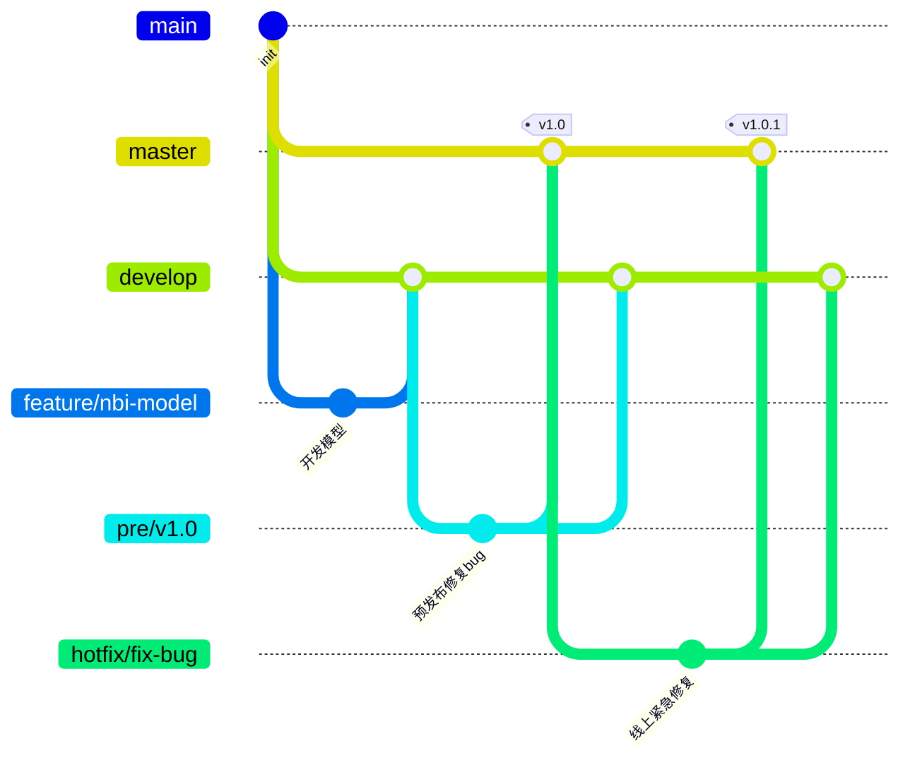

| 银行 | 学生低资产持有 | 大陆→香港 | 国际支付 | 开户便利 | 对你的定位 |
|---|---|---|---|---|---|
| 中银香港 | ★★★★★ | ★★★★★ | ★★★★☆ | ★★★★★（可尝试手机开户） | 主账户候选 |
| 恒生 | ★★★★★ | ★★★★☆ | ★★★★☆ | ★★★★☆ | 主账户候选 |
| 工银亚洲 | ★★★★★ | ★★★★★ | ★★★★☆ | ★★★☆☆ | 跨境备用 |
| 建银亚洲 | ★★★★★ | ★★★★☆ | ★★★☆☆ | ★★★☆☆ | 备用 |
| 汇丰香港 | 视账户/客户条件 | ★★★★☆ | ★★★★★ | ★★★★☆ | 国际化 |
| ZA Bank | ★★★★★ | ★★★☆☆ | ★★★☆☆ | ★★★★☆ | 数字备用 |

- [x] 
- [ ] the 
* [ ] A
+ [ ] B 

