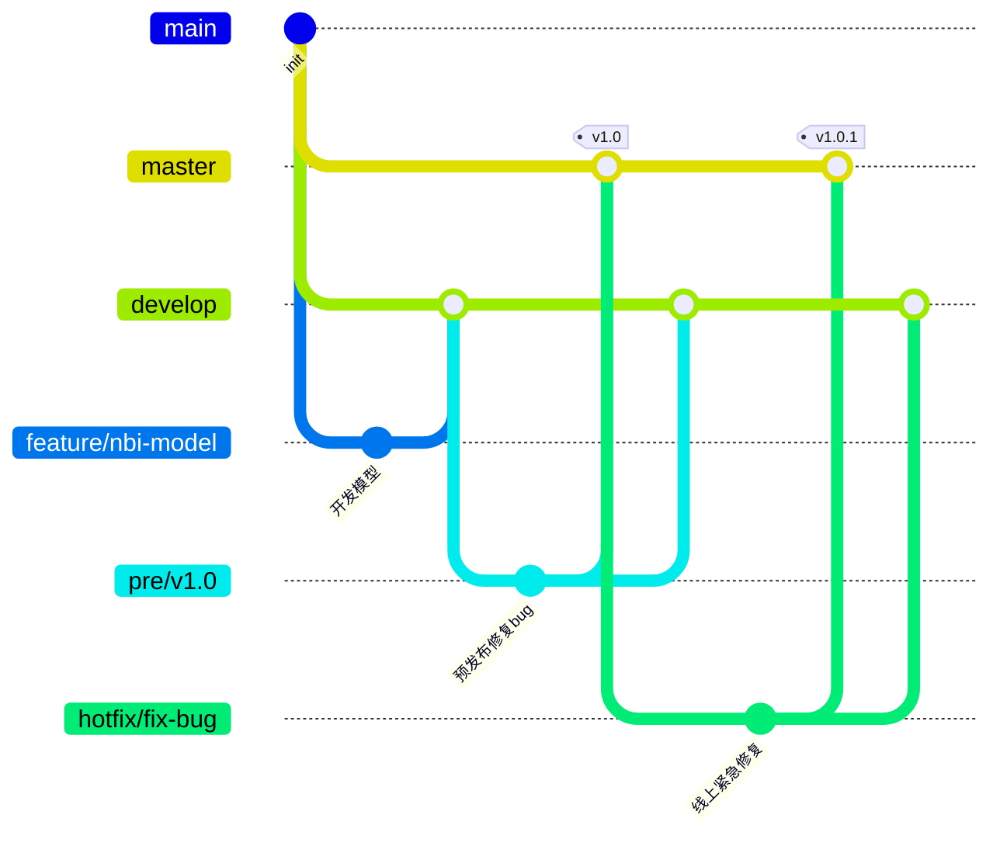

```mermaid
gitGraph
    commit id:"init"
    branch master
    checkout master
    branch develop
    checkout develop
    branch feature/nbi-model
    checkout feature/nbi-model
    commit id: "开发模型"
    checkout develop
    merge feature/nbi-model
    branch pre/v1.0
    checkout pre/v1.0
    commit id:"预发布修复bug"
    checkout master
    merge pre/v1.0 tag:"v1.0"
    checkout develop
    merge pre/v1.0
    checkout master
    branch hotfix/fix-bug
    checkout hotfix/fix-bug
    commit id:"线上紧急修复"
    checkout master
    merge hotfix/fix-bug tag:"v1.0.1"
    checkout develop
    merge hotfix/fix-bug
```